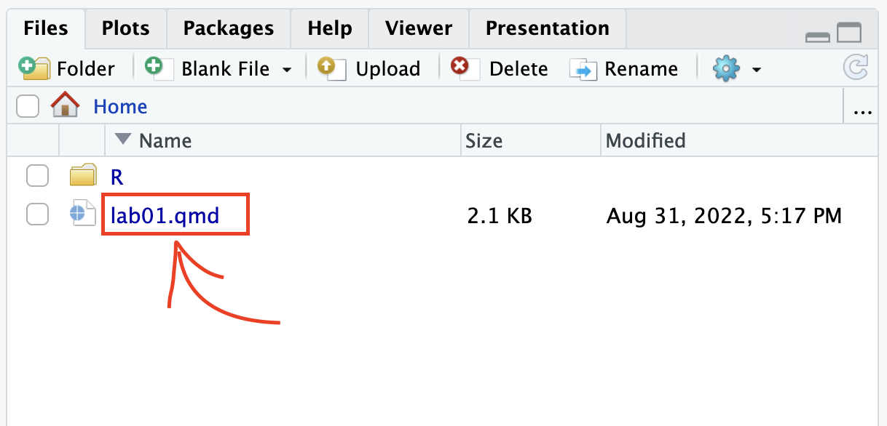

```{r emo-pkg, include=F}
library(emo)
```

The goal of this lab is to acquaint you with RStudio as well as the `R` computing environment. 

First, you must open RStudio.

The easiest way to get started is to use the [containers provided by Duke](https://cmgr.oit.duke.edu/containers). Simply click the link, log in with your Duke ID, click "Reserve STA101" on the right hand side and then click on "STA101" to open the RStudio container.

If you prefer, you can download and install `R` and `RStudio` locally on your computer:

- Go to [https://cran.r-project.org/](https://cran.r-project.org/) to download `R` for your computer by selecting "Download R for..." the appropriate device.

- Go to [https://www.rstudio.com/products/rstudio/download/#download](https://www.rstudio.com/products/rstudio/download/#download) to download the free version of RStudio Desktop.


## Getting started

\ 1. Download the lab template by pasting the code below in your **console**:

```{r download-file, eval=F}
download.file("https://sta101.github.io/static/labs/lab01_template.Rmd", destfile = "lab01.rmd")
```

\ 2. Under the "Files" tab on the right hand side, click on `lab01.rmd` to open the lab template.



\ 3. Complete the exercises below using the space provided.


## Warm up

### YAML

The top portion of your R Markdown file (between the three dashed lines) is called YAML. It stands for "YAML Ain't Markup Language". It is a human friendly data serialization standard for all programming languages. All you need to know is that this area is called the YAML (we will refer to it as such) and that it contains meta information about your document.

Change the `author` name to your name and update the `date` with today's date. Click the yarn `r emo::ji("knit")` to knit the document. What do you notice?

**Note**: if you click the drop-down button next to "knit", you'll find that you can either create an HTML or PDF output file. Try both. In this course, all assignments **must be submitted to gradescope as PDFs**. 

**Note 2**: to avoid issues that can occur while knitting, it is a good idea to knit frequently. **At least after every exercise**.

### Packages

In this lab we will work with two packages: the `tidyverse` packge which is a collection of packages for doing data analysis in a "tidy" way and the `datasauRus` package which contains the data set for today.

```{r load-packages, warning=F, message=F}
library(tidyverse) 
library(datasauRus)
```

If you are using `R` on the container, packages we use should already be installed and only need to be **loaded** with the function `library()`. If you are using a local version of `R` you probably have to run the following code to install the packages (one time only!):

```{r install-packages, eval=F}
install.packages("tidyverse")
install.packages("datasauRus")
```

## Exercises

The data frame we will be working with today is called `datasaurus_dozen` and it's in the `datasauRus` package. Actually, this single data frame contains 13 data sets, designed to show us why data visualization is important and how summary statistics alone can be misleading. The different data sets are marked by the data set variable.

To find out more about the data set, type the following in your console (this will bring up the help file).

```{r help-dino}
?datasaurus_dozen
```


1. Based on the help file, how many rows and how many columns does the datasaurus_dozen file have? What are the variables included in the data frame? Add your responses to your lab report under "Exercise 1".

Let's take a look at the names of the data sets inside of `datasaurus_dozen`. To do so this, we can make a frequency table of the "data set" variable. Run the code chunk below. Note: when you run the code chunk below, a table "prints" to the screen. In general, we say "print to screen" to mean that the output of your code should show up on your screen (when asked to 'print to screen' in an assignment, you should make sure the code output displays in your knitted document).

```{r freq-table-1}
datasaurus_dozen %>%
  count(dataset)
```

The original Datasaurus (dino) data was created by Alberto Cairo. The other Dozen were generated using simulated annealing and the process is described in the paper *Same Stats, Different Graphs: Generating data sets with Varied Appearance and Identical Statistics through Simulated Annealing* by Justin Matejka and George Fitzmaurice. In the paper, the authors simulate a variety of data sets that have the same summary statistics as the original Datasaurus but have very different data.

**Note**: you can view the whole data frame by running the code `view(datasaurus_dozen)` in the console. This will open the data frame in a new tab.

2. Plot y vs. x for the dino data set. Then, calculate the correlation coefficient between x and y for this data set.

Below is the code you will need to complete this exercise. Basically, the answer is already given, but you need to include relevant bits in your Rmd document and successfully knit it and view the results.

Start with the `datasaurus_dozen` and pipe it into the filter function to filter for observations where `dataset == "dino"`. Store the resulting filtered data frame as a new data frame called `dino_data`.

```{r filter-dino}
dino_data <- datasaurus_dozen %>%
  filter(dataset == "dino")
```

There is a lot going on here, so let's slow down and unpack it a bit.

First, the pipe operator: `%>%`, takes what comes before it and sends it as the first argument to what comes after it. So here, we're saying filter the `datasaurus_dozen` data frame for observations where `dataset == "dino"`.

Second, the assignment operator: `<-`, assigns the name dino_data to the filtered data frame. Note in `R` you may use either `<-` or `=` for an assignment operator.

Next, we need to visualize these data. We will use the `ggplot` function for this. Its first argument is the data you're visualizing. Next we define the aesthetic mappings. In other words, the columns of the data that get mapped to certain aesthetic features of the plot, e.g. the x axis will represent the variable called x and the y axis will represent the variable called y. Then, we add another layer to this plot where we define which geometric shapes we want to use to represent each observation in the data. In this case we want these to be points, hence geom_point.


```{r ggplot-dino-x-y}
ggplot(data = dino_data, mapping = aes(x = x, y = y)) +
  geom_point()
```

For the second part of this exercise, we need to calculate a summary statistic: the correlation coefficient. The correlation coefficient (r) measures the strength and direction of the linear association between two variables. You will see that some of the pairs of variables we plot do not have a linear relationship between them. This is exactly why we want to visualize first: visualize to assess the form of the relationship, and calculate r only if relevant. 

In this case, calculating a correlation coefficient really doesn't make sense since the relationship between x and y is definitely not linear, but is instead more 'dinosaur-esque'.

For illustrative purposes only, let's calculate the correlation coefficient between x and y.

```{r dino-cor}
dino_data %>%
  summarize(r = cor(x, y))
```

3. Plot y vs. x for the star dataset. You can (and should) reuse code we introduced above, just replace the dataset name with the desired dataset. Then, calculate the correlation coefficient between x and y for this dataset. How does this value compare to the r of dino?

- To begin, edit the name of the code chunks from `ex-3-1` and `ex-3-2` to something more meaningful, e.g: `plot-star` and `star-correlation` respectively.


4. Finally, let's plot all datasets at once. In order to do this we will make use of faceting, given by the code below:

```{r ex-4-1, eval=F}
ggplot(datasaurus_dozen, aes(x = x, y = y, color = dataset)) +
  geom_point() +
  facet_wrap(~ dataset, ncol = 3) +
  theme(legend.position = "none")
```

And we can use the `group_by` function to generate all the summary correlation coefficients. We'll see these functions again and again.

```{r ex-4-2, eval=F}
datasaurus_dozen %>%
  group_by(dataset) %>%
  summarize(r = cor(x, y)) 
```


5. Describe what `%>%` does. Hint: run the following two code chunks. What do you notice?


```{r dino-summary-1, eval=F}
dino_data %>%
  summarize(mu_x = mean(x),
            mu_y = mean(y))
```


```{r dino-summary-2, eval=F}
  summarize(dino_data, mu_x = mean(x), mu_y = mean(y))
```

6. In the above code chunk, identify each of the following as an argument or a function:

- `summarize`

- `dino_data`

- `mean`

- `x`

- `y`

- `mu_x = mean(x)`

7. Combine the code from exercises 4 and 5 to compute the mean(x) and mean(y) for each data set. Print your result to the screen. 


## Formatting

For all assignments in this course there is a "formatting" component to the grade. To receive full points for "formatting", you must:

\ 1. Have your name (and team name if appropriate) at the top of the knitted document

\ 2. Name every code chunk

\ 3. Pipes `%>%` and ggplot layers `+` should be followed by a newline (see formatting above)

\ 4. Your code should be under the 80 character code limit. (You shouldn't have to scroll to see all your code on the knitted document).

\ 5. All exercises and corresponding pages should be linked on gradescope.

These necessary "tidyverse" style choices are good general practice and will help make your code more legible. For a more extensive list of recommended guidelines, [click here](https://style.tidyverse.org/).

## Submitting to gradescope

In this class, we will submit `.pdf` documents to Gradescope. Once you are fully satisfied with your lab, Knit to .pdf to create a .pdf document. You may notice that the formatting/theme of the report has changed – this is expected. Remember – you must turn in a .pdf file to the Gradescope page before the submission deadline for credit. To submit your assignment: 

- Go to http://www.gradescope.com and click Log in in the top right corner. - Click `School Credentials`, `Duke NetID` and log in using your NetID credentials. 

- Click on your STA 101 course. 

- Click on the assignment, and you'll be prompted to submit it. 

- Mark the pages associated with each exercise, 1 - 5. All of the papers of your lab should be associated with at least one question (i.e., should be “checked”). - Select the first page of your .pdf submission to be associated with the "Formatting" section.

Grading

Total: 50 pts.

    Exercise 1: 7pts

    Exercise 2: 6pts

    Exercise 3: 6pts

    Exercise 4: 6pts

    Exercise 5: 3pts
    
    Exercise 6: 6pts
    
    Exercise 7: 8pts
    
    Workflow and formatting:  8pts
    
    
## Acknowledgements

This assignment was adapated from a lab in [Data Science in a Box](https://datasciencebox.org/).
