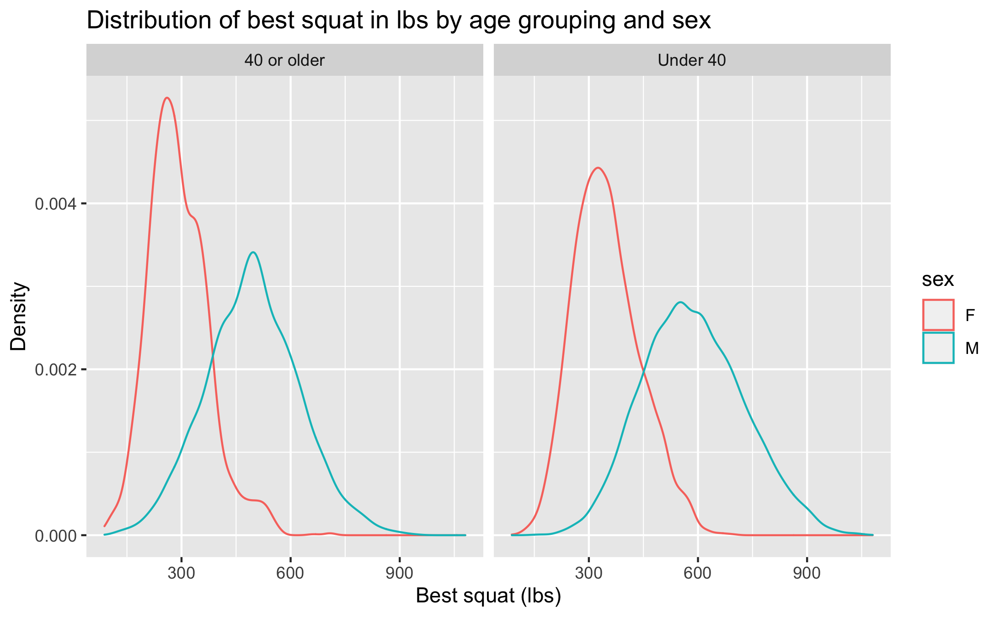

By the end of this lab you will

- create and fit univariate regression models
- compare the fit of different models
- visualize regression models

## Getting started

\ 1. Download the lab template by pasting the code below in your **console**:

```{r download-file, eval=F}
download.file("https://sta101.github.io/static/labs/lab03_template.Rmd",
              destfile = "lab03.rmd")
```

\ 2. Under the "Files" tab on the right hand side, click on `lab03.rmd` to open the lab template.


\ 3. Complete the exercises below using the space provided.

## Warm up

Be sure to update the YAML at the top of the document to include your name and the date.

### Packages

Today we will use our standard `tidyverse` together with `tidymodels` for regression modeling.
```{r load-packages, warning=F, message=F}
library(tidyverse)
library(tidymodels)
```

### Data

Load the data:

```{r load-data, warning=F, message=F, eval = F}
ipf = read_csv("https://sta101.github.io/static/labs/data/ipf_lifts.csv")
```

Today, we will be working with data from [www.openpowerlifting.org](https://www.openpowerlifting.org/). This data was sourced from [tidy tuesday](https://github.com/rfordatascience/tidytuesday/tree/master/data/2019/2019-10-08) and contains international powerlifting records at various meets. At each meet, each lifter gets three attempts at lifting max weight on three lifts: the bench press, squat and deadlift. The data dictionary for this dataset from tidytuesday is reproduced below:

#### Dictionary

|variable         |class     |description |
|:---|:---|:-----------|
|name|character | Individual lifter name |
|sex|character | Binary gender (M/F) |
|event|character | The type of competition that the lifter entered.<br><br>Values are as follows:<br>- SBD: Squat-Bench-Deadlift, also commonly called "Full Power".<br>- BD: Bench-Deadlift, also commonly called "Ironman" or "Push-Pull"<br>- SD: Squat-Deadlift, very uncommon.<br>- SB: Squat-Bench, very uncommon.<br>- S: Squat-only.<br>- B: Bench-only.<br>- D: Deadlift-only. |
|equipment |character | The equipment category under which the lifts were performed.<br><br>Values are as follows:<br>- Raw: Bare knees or knee sleeves.<br>- Wraps: Knee wraps were allowed.<br>- Single-ply: Equipped, single-ply suits.<br>- Multi-ply: Equipped, multi-ply suits (includes Double-ply).<br>- Straps: Allowed straps on the deadlift (used mostly for exhibitions, not real meets). |
|age |double    | The age of the lifter on the start date of the meet, if known. |
|age_class |character | The age class in which the filter falls, for example `40-45` |
|division |character | Free-form UTF-8 text describing the division of competition, like `Open` or `Juniors 20-23` or `Professional`. |
|bodyweight_kg    |double    | The recorded bodyweight of the lifter at the time of competition, to two decimal places. |
|weight_class_kg  |character | The weight class in which the lifter competed, to two decimal places.<br>Weight classes can be specified as a maximum or as a minimum. Maximums are specified by just the number, for example `90` means "up to (and including) 90kg." minimums are specified by a `+` to the right of the number, for example `90+` means "above (and excluding) 90kg."|
|best3squat_kg    |double    | Maximum of the first three successful attempts for the lift.<br>Rarely may be negative: that is used by some federations to report the lowest weight the lifter attempted and failed. |
|best3bench_kg    |double    | Maximum of the first three successful attempts for the lift.<br>Rarely may be negative: that is used by some federations to report the lowest weight the lifter attempted and failed. |
|best3deadlift_kg |double    | Maximum of the first three successful attempts for the lift.<br>Rarely may be negative: that is used by some federations to report the lowest weight the lifter attempted and failed. |
|place |character | The recorded place of the lifter in the given division at the end of the meet.<br><br>Values are as follows:<br>- Positive number: the place the lifter came in.<br>- G: Guest lifter. The lifter succeeded, but wasn't eligible for awards.<br>- DQ: Disqualified. Note that DQ could be for procedural reasons, not just failed attempts.<br>- DD: Doping Disqualification. The lifter failed a drug test.<br>- NS: No-Show. The lifter did not show up on the meet day.|
|date |double    | ISO 8601 Date of the event |
|federation       |character | The federation that hosted the meet. (limited to IPF for this data subset) |
|meet_name        |character | The name of the meet.<br>The name is defined to never include the year or the federation. For example, the meet officially called `2019 USAPL Raw National Championships` would have the MeetName `Raw National Championshps`. |

## Exercises

For all of the following exercises, you should include units on axes labels, e.g. "Bench press (lbs)" or "Bench press (kg)". "Age (years)" etc. This is good practice.

1. Let's begin by taking a look at the bench press powerlifting records. To begin, remove any observations that are negative for bench press. Next, create a new column called `bench3bench_lbs` that converts the record from kg to lbs (you may have to google the conversion). Save your data frame as `ipf_bench`.

2. Using `ipf_bench` from the previous exercise, create a scatter plot to investigate the relationship between bench press (in lbs) and age. Age should be on the x-axis. Add a linear trend-line. Be sure to label all axes and give the plot a title. Comment on what you observe.

3. Write down a linear model to predict lift bench press in lbs from age in $x$, $y$, $\beta$ notation. What is $x$? What is $y$?

4. Fit the linear model. Next, re-write your previous equation replacing $\beta$ with the numeric estimates. This is called the "fitted" linear model. Interpret each estimate of $\beta$. Are the interpretations reasonable?

5. Building on your `ipf_bench` data frame, create a new column called `age2` that takes the age of each lifter and squares it. Plot bench press in lbs vs `age2` and add a linear best fit line. Does this model look like it fits the data better?

6. Fit the model from exercise 5 and compare the $R^2$ to the model from exercise 4. Which model do you prefer? Overall, is age a meaningful predictor of the weight lifted?

7. Recreate the plot below. Make sure axes and title labels are exactly matching, including spelling, capitalization, etc. Based on the plot below, which impacts squat weight more, age or sex?

- Hint: You will need to create a couple new columns. One to classify age appropriately and one to convert squats to the plotted units. Notice that there are no negative squat values on the x-axis.



8. Create a scatter plot to investigate the relationship between best deadlift (in lbs) and the lifter's bodyweight (in lbs). Bodyweight should be on the x-axis.  Add a linear trend-line. Be sure to label all axes and give the plot a title. Comment on what you observe.

9. Fit the linear model displayed in the previous exercise and write down the **fitted model equation**, replacing $\hat{\beta}$ with the fitted estimate. Interpret the $\beta$. Report $R^2$. Is body weight an important predictor of deadlifting ability? Why or why not?

10. Do lifters who fail a drug test perform better or worse at squats than other lifters? Does this vary across sexes? We'll answer this question in two parts. First, remove all observations from the data frame that have `NA` listed under squat. Next, create a new column called `doping_status` that takes value `doping` if the lifter failed a drug test and `not doping` otherwise. Save this data frame as `ipf_dope`.

11. Using `ipf_dope` from the previous exercise, compute the 5%, 50%, 95% quantiles for squats across both `sex` and `doping_status`. You can use either squats in kg or lbs here. With this information, answer the question "Do lifters who fail a drug test perform better or worse at squats than other lifters?"

## Formatting

**Reminder**: For all assignments in this course there is a "formatting" component to the grade. To receive full points for "formatting", you must:

\ 1. Have your name at the top of the knitted document

\ 2. Pipes `%>%` and ggplot layers `+` should be followed by a newline (see formatting above)

\ 3. Your code should be under the 80 character code limit. (You shouldn't have to scroll to see all your code on the knitted document).

\ 4. All exercises and corresponding pages should be linked on gradescope.

These necessary "tidyverse" style choices are good general practice and will help make your code more legible. For a more extensive list of recommended guidelines, [click here](https://style.tidyverse.org/).

## Submitting to gradescope

In this class, we will submit `.pdf` documents to Gradescope. Once you are fully satisfied with your lab, Knit to .pdf to create a .pdf document. You may notice that the formatting/theme of the report has changed – this is expected. Remember – you must turn in a .pdf file to the Gradescope page before the submission deadline for credit. To submit your assignment: 

- Go to [http://www.gradescope.com](http://www.gradescope.com) and click Log in in the top right corner. - Click `School Credentials`, `Duke NetID` and log in using your NetID credentials. 

- Click on your STA 101 course. 

- Click on the assignment, and you'll be prompted to submit it. 

- Mark the pages associated with each exercise, 1 - 5. All of the papers of your lab should be associated with at least one question (i.e., should be “checked”). - Select the first page of your .pdf submission to be associated with the "Formatting" section.

## Grading

Total: 50 pts.

    Exercise 1: 3pts

    Exercise 2: 6pts

    Exercise 3: 4pts

    Exercise 4: 4pts

    Exercise 5: 4pts
    
    Exercise 6: 4pts
    
    Exercise 7: 6pts
    
    Exercise 8: 5pts
    
    Exercise 9: 6pts
    
    Exercise 10: 3pts
    
    Exercise 11: 3pts
    
    Workflow and formatting:  2pts
    