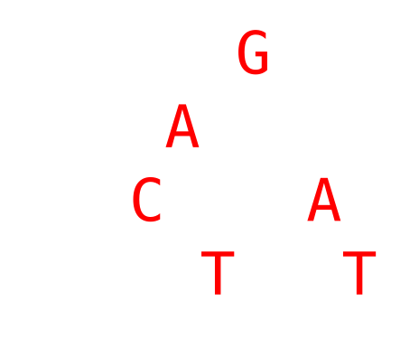
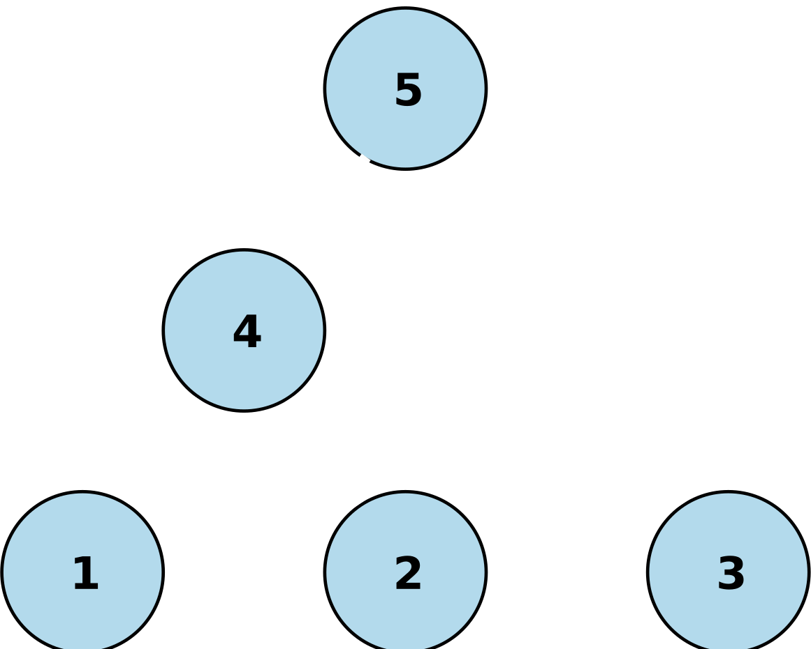

```{r kakashi-theme, message=F, echo=F, warning=F}
#htmltools::includeCSS("https://raw.githubusercontent.com/malcolmbarrett/kakashi/master/kakashi.css")
```

```{r load-packages, include = FALSE}
# Add any additional packages you need to this chunk
library(tidyverse)
library(palmerpenguins)
library(knitr)
library(tidymodels)
library(DT)
```

```{r setup, include=FALSE}
# For better figure resolution
knitr::opts_chunk$set(warning = FALSE, 
                      message = FALSE, 
                      echo = FALSE, 
                      fig.retina = 3, 
                      dpi = 300, fig.width = 6, 
                      fig.asp = 0.618, 
                      out.width = "75%",
                      fig.align = "center")

# set consistent theme
theme_set(ggplot2::theme_minimal())

color_palette <- list(gray = "#999999", 
                      green = "#009E73", 
                      yellow = "#F0E442", 
                      darkblue = "#0072B2", 
                      purple = "#800080", 
                      orange = "#ff8c00",
                      cyan = "#008B8B"
                      )
```


```{r load-data, include=FALSE}
# Load your data here
```

## Meet the professor

.pull-left[

- Alexander Fisher

- [alexander.fisher@duke.edu](alexander.fisher@duke.edu)

- [Office hours](https://sta101.github.io/)

  - Monday/Wednesday 9:30-10:30am

- A little bit about my research...
]

--

.pull-right[

```{r, echo=FALSE,out.width = '60%'} 


# magick::image_read_pdf("img/01/alignment_xaringan.pdf",
                       # pages = 1)
# magick::image_read_pdf("img/01/MCC-WNV.pdf",
#                        pages = 1)
```
]

---
## Why data analysis and statistical inference?

```{r, echo=FALSE,out.width = '75%'} 
knitr::include_graphics("img/01/prisonLetter.png")
```

- $26 \times 25 \times 24 \times ... \times 2 \times 1 = 4 \times 10^{26}$ possible combinations

--

- Check 100M per second

- 120,000,000,000 years of computational time

---
## Why data analysis and statistical inference?

- On January 28 1986 the Challenger space shuttle exploded 73 seconds after takeoff.

- It was determined failed O rings were the cause: [https://en.wikipedia.org/wiki/O-ring](https://en.wikipedia.org/wiki/O-ring)

- Could the Challenger disaster have been prevented?

- [Challenger O-ring logistic regression](https://byuistats.github.io/Statistics-Notebook/Analyses/Logistic%20Regression/Examples/challengerLogisticReg.html)

---
## Why data analysis and statistical inference?

- [Infectious disease tracker](https://nextstrain.org)

- [José Ramirez is Baseball's Last-Appreciate Superstar](https://fivethirtyeight.com/features/jose-ramirez-is-baseballs-least-appreciated-superstar/)

---
## Course learning objectives

By the end of this course you will:

- explore, visualize and analyze real data in a reproducible manner

- gain proficiency in the statistical computing language R and integrated development environment RStudio

- work collaboratively to apply statistical analyses to a data set of your own choosing 

- present and communicate statistical results effectively

- be a critical consumer of statistics

---

## The course website

[sta101.github.io](https://sta101.github.io)

Here you'll find 

- course schedule

- syllabus

- office hours

and three important links: R containers, slack and the book.

Let's take a look...

---

## Logistics

- Prepare, participate, practice, perform

- Policy: sharing / reusing code

- Course community & learning environment

- Late policy and regrade requests

- Resources

---

## Logistics

- **Prepare, participate, practice, perform**

  - prepare: watch preparatory videos or read from the book
  - participate in lectures, labs, office hours and slack
  - practice applying concepts on in-class application exercises
  - perform on labs, exams and projects

```{r, echo=FALSE,out.width = '100%'} 
  knitr::include_graphics("img/01/assignments.png")
```

---

## Logistics

- **Policy: sharing / reusing code**

  - you must always cite any code you copy or use as inspiration. Copied code without citation is plagiarism and will result in a 0 for the assignment

  - copying and citing a large amount of code to satisfy a main objective of an assignment will result in a 0 for the assignment

  - carefully read each assignment so you know what is permitted and what is not. If you are ever unsure what is allowed, please ask a member of the teaching team

---

## Logistics

**Course community & learning environment**


Course community
- Uphold the Duke Community Standard: 
> - I will not lie, cheat, or steal in my academic endeavors;
>- I will conduct myself honorably in all my endeavors; and
> - I will act if the Standard is compromised.

--

Learning environment

  - Respect, honor, and celebrate our diverse community 
  - Learning environment that is welcoming, inclusive, and accessible to everyone

---

## Logistics

- **Late policy and regrade requests**

  Late policy
  - late work is not accepted
  - to accommodate this strict policy, your lowest lab will be dropped
  - missed lab or exams can only be excused under exceptional circumstances and requires a letter from the Dean
  
  Regrade requests
  - must be submitted within 4 days of when the assignment is returned

---
## Logistics

- **Resources**
  
  - Check the [syllabus](https://sta101.github.io/syllabus)
  - Attend [office hours](https://duke.box.com/s/5d31hvs4jkwcn4qpwz827zkpiaic7177)
  - Post on [slack](https://sta101-su22.slack.com/)
  - Ask/email a member of the teaching team

---

## Additional resources

**Academic Resource Center**

The [Academic Resource Center (ARC)](https://arc.duke.edu/) offers free services to all students during their undergraduate careers at Duke. 

Services include 
  - Learning Consultations
  - Peer Tutoring and Study Groups
  - ADHD/LD Coaching, Outreach Workshops
  - and more. 

  
Contact the ARC at [ARC@duke.edu](mailto:arc@duke.edu) or call 919-684-5917 to schedule an appointment. 

---

## Additional resources

**CAPS**

[Duke Counseling & Psychological Services (CAPS)](https://studentaffairs.duke.edu/caps) helps Duke Students enhance strengths and develop abilities to successfully live, grow and learn in their personal and academic lives. 

Services include 
- brief individual and group counseling
- couples counseling
- outreach to student groups
- and more...

---

## STA101 Strategy Guide

**tl;dr**

1. Bookmark the course webpage: [sta101.github.io](https://sta101.github.io)

2. Check the schedule frequently

3. Prepare (videos), Practice (in-class), Perform honorably (labs, exams, projects), Profit

---

## Your turn

- Check your email / sakai announcements for slack invite.

- Post on [slack](https://sta101-su22.slack.com/)

- When you're done, fill out [this short questionnaire](https://forms.gle/UkBhKxZQvnh1mToRA)

- **Notice**: Drop/Add ends Wednesday June 29 at 11:59pm

```{r echo = F}
countdown::countdown(minutes = 5, seconds = 0)
```

```{r}

```


## Jump in

- [Click here](https://cmgr.oit.duke.edu/containers) to go to the Duke containers website. Click "Reserve"

- Onto today's application exercise: [ae1](https://sta101.github.io/static/appex/ae1.html)